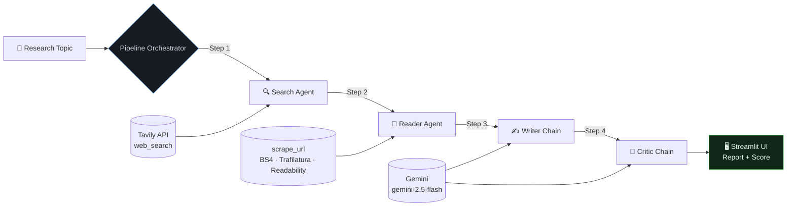

# Multi-Agent Research Assistant

An agentic research workflow built with LangChain, Google Gemini, Tavily, and Streamlit. The project turns a natural-language topic into a structured research report by coordinating specialized agents for web search, content extraction, report writing, and critical review.

## Overview

The application combines web retrieval and language-model reasoning into a four-stage pipeline:

1. **Search agent** - Uses Tavily to find recent sources, titles, URLs, and snippets.
2. **Reader agent** - Selects a relevant result and extracts readable article content with `trafilatura`, `readability-lxml`, and Beautiful Soup fallbacks.
3. **Writer chain** - Uses Google Gemini to produce a report with an introduction, key findings, conclusion, and source URLs.
4. **Critic chain** - Reviews the report, assigns a score out of 10, and identifies strengths and areas for improvement.

The Streamlit interface displays the pipeline progress, raw intermediate results, final report, and critic feedback. Reports can be downloaded as Markdown files.

## Features

- Multi-agent research workflow with clearly separated responsibilities
- Tavily-powered web search for recent information
- Layered article extraction with request timeout and error handling
- Gemini-powered report generation and review
- Interactive Streamlit dashboard with pipeline status indicators
- Raw search and scraped-content inspection
- Markdown report download
- Reusable Python pipeline for scripts and other interfaces

## Architecture



The core orchestration is implemented in `src/pipelines/pipeline.py`. Model and agent definitions live in `src/agents/agents.py`, and the search/scraping tools live in `src/tools/tools.py`.

## Requirements

- Python 3.10 or newer
- A Google AI API key with access to Gemini
- A Tavily API key
- Internet access for search and page retrieval

## Installation

### 1. Clone the repository

```bash
git clone <repository-url>
cd Multi-AI-Agent-with-Langchain
```

### 2. Create and activate a virtual environment

Windows PowerShell:

```powershell
python -m venv .venv
.\.venv\Scripts\Activate.ps1
```

macOS/Linux:

```bash
python3 -m venv .venv
source .venv/bin/activate
```

### 3. Install dependencies

```bash
python -m pip install --upgrade pip
pip install -r requirements.txt
pip install langchain-google-genai
```

The additional `langchain-google-genai` install is required because the project imports `ChatGoogleGenerativeAI` from that package.

### 4. Configure environment variables

Create a `.env` file in the project root:

```env
GOOGLE_API_KEY=your_google_ai_api_key
TAVILY_API_KEY=your_tavily_api_key
```

Never commit `.env` or place real API keys in source files, documentation, screenshots, or issue reports. If a key has been exposed, revoke it and create a replacement immediately.

## Running the Application

### Streamlit interface

Start the interactive research assistant with:

```bash
streamlit run app.py
```

Then open the local URL shown by Streamlit, enter a research topic, and select **Initiate Pipeline**. When processing completes, the page provides:

- Search results and extracted content in expandable panels
- The generated research report
- A Markdown download button
- Critic score, strengths, and improvement recommendations

### Python pipeline

To run the pipeline from Python:

```python
from src.pipelines.pipeline import run_research_pipeline

result = run_research_pipeline("The impact of AI on the job market")

print(result["report"])
print(result["feedback"])
```

The returned dictionary contains `search_results`, `scraped_content`, `report`, and `feedback`.

The included `main.py` demonstrates a direct pipeline invocation:

```bash
python main.py
```

## Project Structure

```text
.
├── app.py                    # Streamlit user interface
├── main.py                   # Direct Python entry point
├── requirements.txt          # Python dependencies
├── src/
│   ├── agents/
│   │   └── agents.py         # Gemini model, agents, writer, and critic chains
│   ├── pipelines/
│   │   └── pipeline.py       # Four-stage research orchestration
│   └── tools/
│       └── tools.py          # Tavily search and URL scraping tools
└── README.md
```

## Configuration and Customization

### Change the model

The Gemini model is configured in `src/agents/agents.py`:

```python
llm = ChatGoogleGenerativeAI(
    model="gemini-2.5-flash-lite",
    temperature=0,
)
```

You can change the model name or temperature to match your latency, cost, and quality requirements.

### Adjust search results

The Tavily tool currently requests up to five results per query. Modify `max_results` in `src/tools/tools.py` to change the number of candidate sources.

### Adjust extracted content

The scraper limits returned content to 5,000 characters. This keeps prompts manageable, but the limit can be changed in `src/tools/tools.py` when longer source context is needed.

## Troubleshooting

### `ModuleNotFoundError: langchain_google_genai`

Install the missing integration package:

```bash
pip install langchain-google-genai
```

### Authentication errors

Confirm that `GOOGLE_API_KEY` and `TAVILY_API_KEY` are present in the root `.env` file, contain valid keys, and are loaded before starting Streamlit or Python.

### A page cannot be scraped

Some sites block automated requests, require JavaScript, or expose little readable content. The scraper has multiple extraction fallbacks, but it cannot guarantee access to every website. Try a different source or topic query.

### Requests are slow

The workflow performs web search, page retrieval, report generation, and review sequentially. Slow responses can result from the search provider, the target website, model latency, or rate limits.

## Limitations

- Generated reports depend on the quality and availability of external sources.
- The reader currently scrapes one selected URL rather than synthesizing many full articles.
- The system does not independently verify every claim in the generated report.
- API usage may incur provider costs and rate limits.
- Website terms of service and robots policies should be respected when retrieving content.

## Security

Keep API keys outside version control and use least-privilege credentials where possible. Before publishing this repository, verify that `.env` is ignored, remove any exposed credentials from the working tree and Git history, and rotate keys that may already have been exposed.

## License

See [LICENSE](LICENSE) for the project license.